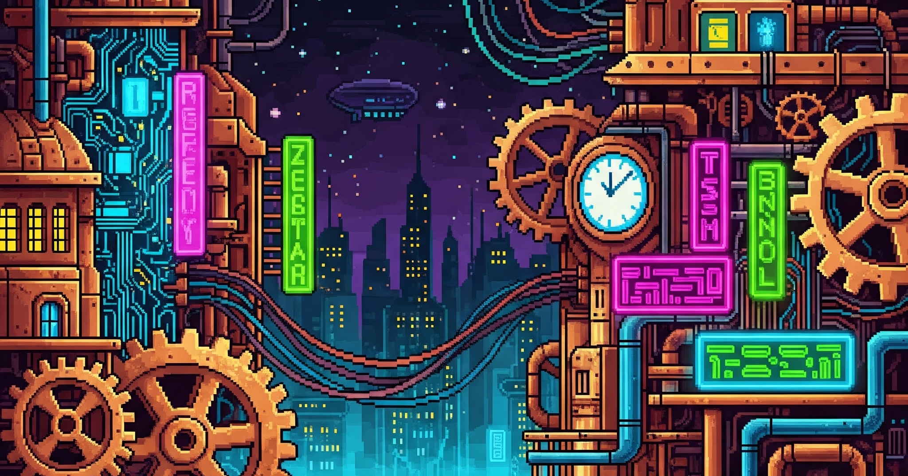

  <!--  -->

  # RITHVIK KASARLA
  ### AI/ML Engineer & Systems Architect
  
  *M.Eng Computer Science @ Cornell Tech*
  
  
  
  
   
  

---

### About Me 
> "I enjoy trying to think like an inventor - start with speculative design and move from there."
 
* **Current Status:** Completing Master of Engineering in CS at **Cornell Tech**.
* **Vibe:** Hands-on, experimental, trying to design cool things.

---

### Exploration
- 🧪 Exploring projects at the intersection of **machine learning**, **data science**, and **robotics**
- 🛠️ Building things that make life **easier, smarter, and more connected**
- 📈 Focused on becoming a **better engineer, thinker, and inventor** every day

---

### TECHNICAL ARSENAL

| **Domain** | **The Stack** |
| :--- | :--- |
| **LLM Systems** | Retrieval Pipelines, GraphRAG, Agent Workflows, Chunkers, Evaluators |
| **Machine Learning** | PyTorch, Computer Vision, Adversarial Training, Model Optimization |
| **Backend & Infra** | FastAPI, Node.js/Express, Async Pipelines, Docker, FAISS, Neo4j, AWS |

  

  

